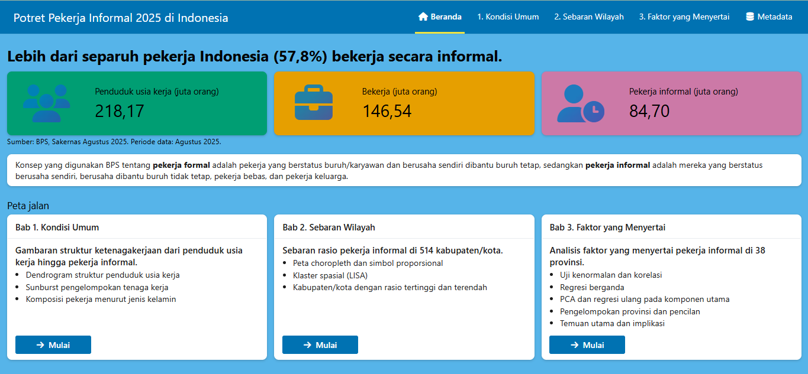
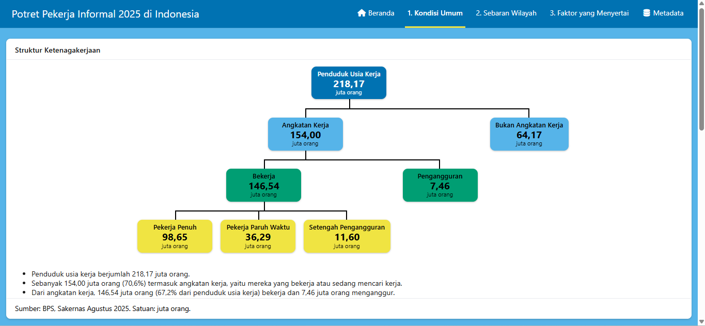
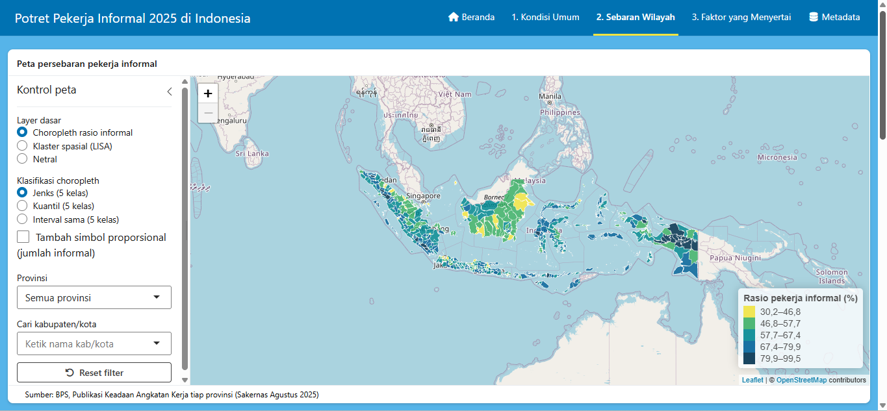
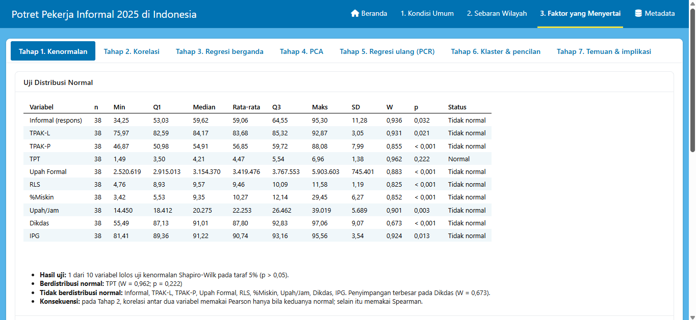

# Potret Pekerja Informal Indonesia

Dasbor R Shiny berbahasa Indonesia: *dari struktur nasional, sebaran kabupaten/kota, hingga faktor yang menyertai pekerja informal.* Dibuat untuk UAS Visualisasi Data 2026 dengan tiga topik: **hierarki** (Bab 1), **geospasial** (Bab 2), dan **multivariat** (Bab 3).

- **Aplikasi:** https://naufaldzakizaidan.shinyapps.io/Dashboard-UAS-Visdat/
- **Repositori:** https://github.com/Zidan-NDZ/uas-visdat-informal.git
- **Periode data:** Sakernas Agustus 2025



| Bab 1 — Hierarki | Bab 2 — Geospasial | Bab 3 — Multivariat |
|---|---|---|
|  |  |  |

## Isi aplikasi

| Halaman | Isi |
|---|---|
| Beranda | Pesan utama (57,8% pekerja Indonesia informal), KPI, definisi informal, peta jalan |
| Bab 1 — Kondisi umum | Dendrogram kartu dan sunburst (ukuran = jumlah orang, warna = % perempuan) dengan drill-down |
| Bab 2 — Sebaran wilayah | Choropleth rasio informal 514 kab/kota (Jenks, kuantil, interval sama), simbol proporsional, klaster spasial LISA, filter dan pencarian |
| Bab 3 — Faktor yang menyertai | PCA biplot, scree plot, parallel coordinates, heatmap terklaster, korelasi dengan `Informal`, profil klaster, brushing & linking, toggle pencilan |
| Metadata | Sumber data, tabel data yang dipakai (dapat diunduh CSV), metadata variabel, keterbatasan |

Temuan utama dan implikasi kebijakan ditampilkan di akhir tiap bab (Bab 1–3).

Analisis bersifat korelasional: variabel disebut *berasosiasi*, bukan *menyebabkan*.

## Sumber data

Daftar lengkap (judul, tahun, URL, tanggal akses) ada di [`data/sumber.csv`](data/sumber.csv).

| Data | Sumber | Dipakai di |
|---|---|---|
| Struktur penduduk usia kerja, status pekerjaan, jenis kelamin | BPS, Sakernas Agustus 2025 | Beranda, Bab 1 |
| Pekerja informal dan total pekerja 514 kab/kota | BPS, Sakernas Agustus 2025 | Bab 2 |
| 10 variabel 38 provinsi (`Informal`, `TPAK-L`, `TPAK-P`, `TPT`, `Upah Formal`, `RLS`, `%Miskin`, `Upah/Jam`, `Dikdas`, `IPG`) | BPS, tabel dinamis; `Dikdas` dari Statistik Pendidikan Indonesia (tahun: 2025) | Bab 3 |
| Batas kabupaten/kota | Lapak GIS, `LapakGIS_Batas_Kabupaten_2024` (sumber asli: BIG) | Bab 2 |

**Lisensi batas wilayah:** Lapak GIS tidak mencantumkan lisensi eksplisit pada [halaman sumbernya](https://www.lapakgis.com/2022/01/shp-batas-kabupaten-kota-indonesia.html). Menurut halaman tersebut, data berasal dari Badan Informasi Geospasial (Pusat Pemetaan Batas Wilayah) dan bersifat indikatif, bukan batas definitif. Shapefile tidak didistribusikan ulang di repositori ini. Peta dasar © kontributor [OpenStreetMap](https://www.openstreetmap.org/copyright).

## Struktur folder

```
uas-visdat-informal/
├── app.R                  
├── komponen/
│   ├── ui.R               
│   └── server.R           
├── data/
│   ├── raw/               
│   ├── olahan.rds      
│   ├── olahan/            
│   └── sumber.csv         
├── docs/                  
├── README.md
└── .gitignore
```

## Menjalankan secara lokal

1. Pasang R (versi 4.5.x atau lebih baru) dan paket runtime:
   ```r
   install.packages(c("shiny", "bslib", "plotly", "leaflet", "sf", "dplyr",
                      "heatmaply", "viridisLite", "DT", "tibble", "htmlwidgets"))
   ```
2. Clone repositori, lalu jalankan dari folder proyek:
   ```bash
   git clone https://github.com/Zidan-NDZ/uas-visdat-informal.git
   cd uas-visdat-informal
   ```
   ```r
   shiny::runApp()
   ```
   `data/olahan.rds` sudah disertakan di repositori, sehingga aplikasi langsung berjalan tanpa shapefile.

### Membangun ulang data (opsional)

Shapefile batas wilayah (`LapakGIS_Batas_Kabupaten_2024`, ±435 MB) **tidak disertakan** karena melebihi batas ukuran file GitHub (100 MB). Untuk membangun ulang `olahan.rds`:

1. Unduh shapefile lengkap (`.shp`, `.shx`, `.dbf`, `.prj`) dari Lapak GIS dan letakkan di `data/raw/`.
2. Pastikan `Dataset.xlsx` dan `kode_provinsi.csv` ada di `data/raw/`.
3. Pasang paket tambahan: `install.packages(c("readxl", "spdep", "classInt", "cluster", "rmapshaper"))`.
4. **Hapus `data/olahan.rds`**, lalu jalankan `shiny::runApp()`. `bangun_data()` berjalan otomatis (Jenks, LISA 999 simulasi, PCA, klaster; beberapa menit).

Cek fungsi murni kapan saja dengan `validasi_fungsi()` di console setelah `source("app.R")`. Invarian data (`validasi_data()`) berjalan otomatis di akhir `bangun_data()`; bila gagal, `olahan.rds` tidak disimpan.

## Paket

- **Aplikasi (runtime):** `shiny`, `bslib`, `plotly`, `leaflet`, `sf`, `dplyr`, `heatmaply`, `viridisLite`, `DT` (tabel provinsi yang bisa diklik di Bab 3). Dipanggil lewat `::`: `htmlwidgets`, `tibble`.
- **Hanya untuk `bangun_data()`:** `readxl`, `spdep`, `classInt`, `cluster`, `rmapshaper`.

## Deploy ke shinyapps.io

Pastikan `data/olahan.rds` sudah dibangun lokal (di server tidak ada shapefile, jadi `bangun_data()` tidak boleh terpanggil di sana), lalu:

```r
rsconnect::deployApp(appFiles = c("app.R", "komponen/ui.R", "komponen/server.R", "data/olahan.rds"))
```

Folder `data/raw/`, `data/olahan/`, `data/sumber.csv`, dan `docs/` tidak ikut di-deploy. Perubahan kode di GitHub tidak otomatis memperbarui aplikasi online; jalankan `deployApp()` lagi setelah mengubah kode.

## Keterbatasan

1. `Dikdas` memakai sumber dan periode acuan yang berbeda dari variabel lain (Statistik Pendidikan Indonesia, 2025).
2. Kabupaten kecil (mis. Supiori, 8.042 pekerja) estimasinya kurang stabil.
3. Analisis korelasional tingkat provinsi (ecological fallacy); `Informal` ikut sebagai salah satu dari 10 variabel.
4. Agregasi kab/kota ke provinsi berselisih dari angka provinsi: Papua Barat −1,03; Papua −0,94; Bengkulu −0,55 poin persen.
5. LISA sensitif terhadap pilihan k tetangga terdekat (k = 5 dipilih secara konvensional).
6. Rincian jenis kelamin Bukan Angkatan Kerja dan Pengangguran tidak ada di dataset (simpul berwarna abu-abu di sunburst).
7. Tidak ada pengujian otomatis tingkat aplikasi; kualitas dijaga lewat `validasi_data()`, `validasi_fungsi()`, dan QA manual.

## Deklarasi penggunaan AI

Pengerjaan memakai alat AI berikut. Tiap tiket dikerjakan dari `SPEC.md` dan `TICKETS.md` yang disusun bersama AI, dan seluruh keluaran ditinjau serta diuji oleh pemilik proyek.

| Alat | Dipakai untuk |
|---|---|
| Claude (Anthropic) | Menyusun SPEC dan tiket, merapihkan tampilan UI dan peta OSM, debugging kode R, serta penyusunan README |
